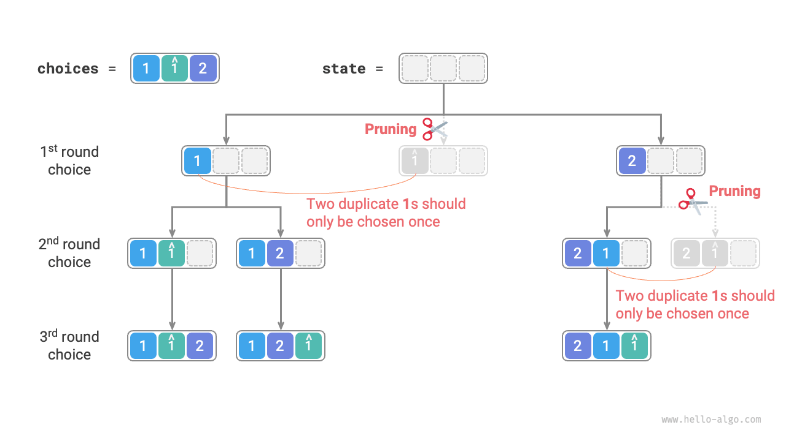

# Permutation problem

The permutation problem is a typical application of the backtracking algorithm. It is defined as finding all possible arrangements of elements from a given set (such as an array or string).

The table below lists several example data, including the input arrays and their corresponding permutations.

<p align="center"> Table <id> &nbsp; Permutation examples </p>

| Input array | Permutations                                                   |
| :---------- | :----------------------------------------------------------------- |
| $[1]$       | $[1]$                                                              |
| $[1, 2]$    | $[1, 2], [2, 1]$                                                   |
| $[1, 2, 3]$ | $[1, 2, 3], [1, 3, 2], [2, 1, 3], [2, 3, 1], [3, 1, 2], [3, 2, 1]$ |

## Cases without equal elements

!!! question

    Enter an integer array without duplicate elements and return all possible permutations.

From the perspective of the backtracking algorithm, **we can imagine the process of generating permutations as a series of choices**. Suppose the input array is $[1, 2, 3]$, if we first choose $1$, then $3$, and finally $2$, we obtain the permutation $[1, 3, 2]$. Backtracking means undoing a choice and then continuing to try other choices.

From the code perspective, the candidate set `choices` contains all elements of the input array, and the state `state` contains elements that have been selected so far. Please note that each element can only be chosen once, **thus all elements in `state` must be unique**.

As shown in the following figure, we can unfold the search process into a recursive tree, where each node represents the current state `state`. Starting from the root node, after three rounds of choices, we reach the leaf nodes, each corresponding to a permutation.


### Pruning of repeated choices

To ensure that each element is selected only once, we consider introducing a boolean array `selected`, where `selected[i]` indicates whether `choices[i]` has been selected. We base our pruning operations on this array:

- After making the choice `choice[i]`, we set `selected[i]` to $\text{True}$, indicating it has been chosen.
- When iterating through the choice list `choices`, skip all nodes that have already been selected, i.e., prune.

As shown in the following figure, suppose we choose 1 in the first round, 3 in the second round, and 2 in the third round, we need to prune the branch of element 1 in the second round and elements 1 and 3 in the third round.


Observing the above figure, this pruning operation reduces the search space size from $O(n^n)$ to $O(n!)$.

### Code implementation

After understanding the above information, we can "fill in the blanks" in the framework code. To shorten the overall code, we do not implement individual functions within the framework code separately, but expand them in the `backtrack()` function:

```src
[file]{permutations_i}-[class]{}-[func]{permutations_i}
```

## Considering cases with equal elements

!!! question

    Enter an integer array, **which may contain duplicate elements**, and return all unique permutations.

Suppose the input array is $[1, 1, 2]$. To differentiate the two duplicate elements $1$, we mark the second $1$ as $\hat{1}$.

As shown in the following figure, half of the permutations generated by the above method are duplicates.


So, how do we eliminate duplicate permutations? Most directly, consider using a hash set to deduplicate permutation results. However, this is not elegant, **as branches generating duplicate permutations are unnecessary and should be identified and pruned in advance**, which can further improve algorithm efficiency.

### Pruning of equal elements

Observing the following figure, in the first round, choosing $1$ or $\hat{1}$ results in identical permutations under both choices, thus we should prune $\hat{1}$.

Similarly, after choosing $2$ in the first round, choosing $1$ and $\hat{1}$ in the second round also produces duplicate branches, so we should also prune $\hat{1}$ in the second round.

Essentially, **our goal is to ensure that multiple equal elements are only selected once in each round of choices**.



### Code implementation

Based on the code from the previous problem, we consider initiating a hash set `duplicated` in each round of choices, used to record elements that have been tried in that round, and prune duplicate elements:

```src
[file]{permutations_ii}-[class]{}-[func]{permutations_ii}
```

Assuming all elements are distinct from each other, there are $n!$ (factorial) permutations of $n$ elements; when recording results, it is necessary to copy a list of length $n$, using $O(n)$ time. **Thus, the time complexity is $O(n!n)$**.

The maximum recursion depth is $n$, using $O(n)$ frame space. `Selected` uses $O(n)$ space. At any one time, there can be up to $n$ `duplicated`, using $O(n^2)$ space. **Therefore, the space complexity is $O(n^2)$**.

### Comparison of the two pruning methods

Please note, although both `selected` and `duplicated` are used for pruning, their targets are different.

- **Repeated choice pruning**: There is only one `selected` throughout the search process. It records which elements are currently in the state, aiming to prevent an element from appearing repeatedly in `state`.
- **Equal element pruning**: Each round of choices (each call to the `backtrack` function) contains a `duplicated`. It records which elements have been chosen in the current traversal (`for` loop), aiming to ensure equal elements are selected only once.

The following figure shows the scope of the two pruning conditions. Note, each node in the tree represents a choice, and the nodes from the root to the leaf form a permutation.


