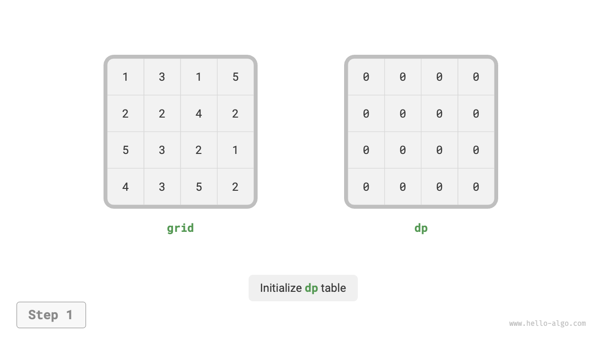
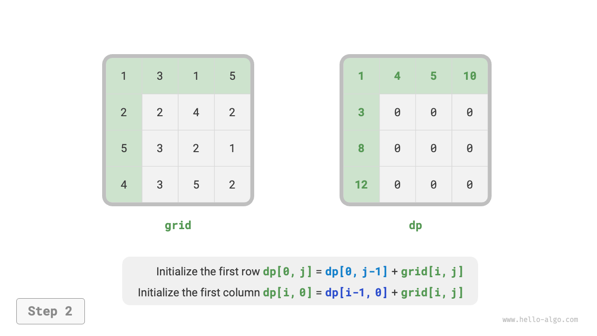
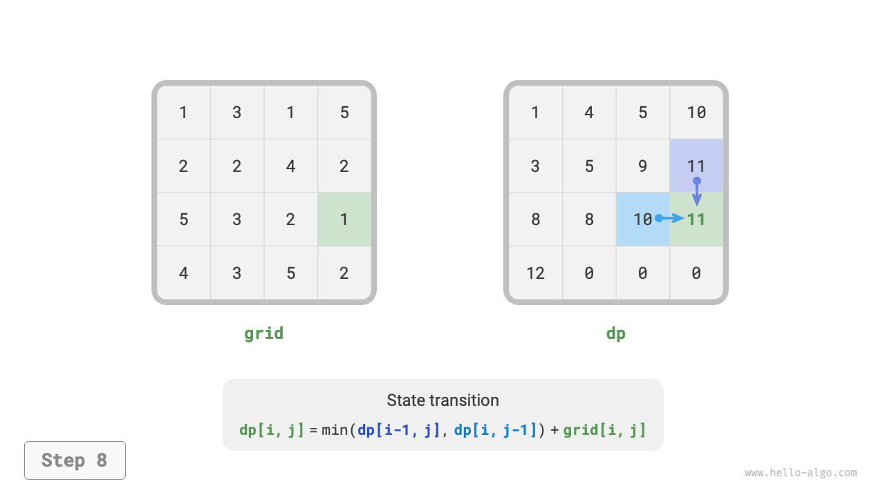
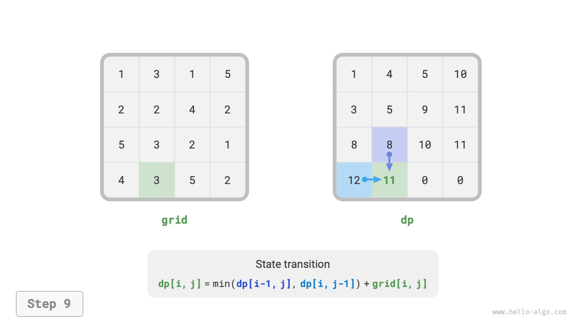
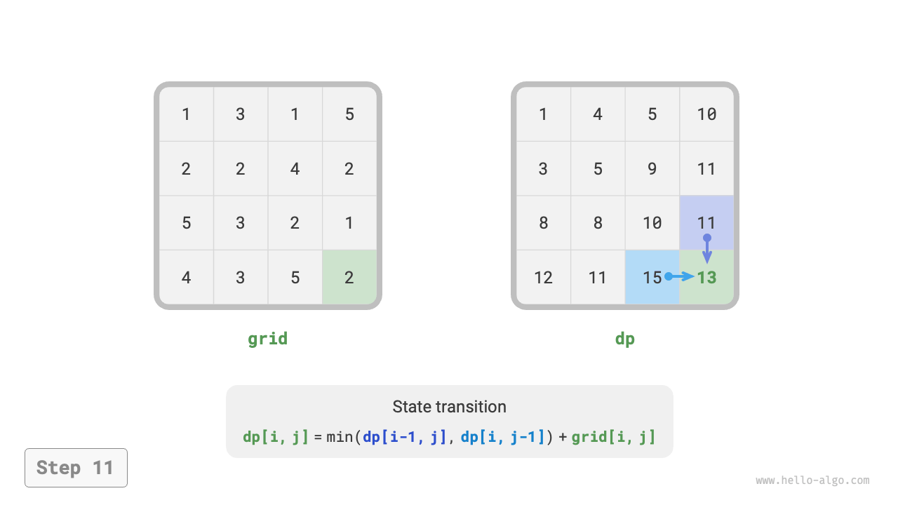

# Dynamic programming problem-solving approach

The last two sections introduced the main characteristics of dynamic programming problems. Next, let's explore two more practical issues together.

1. How to determine whether a problem is a dynamic programming problem?
2. What are the complete steps to solve a dynamic programming problem?

## Problem determination

Generally speaking, if a problem contains overlapping subproblems, optimal substructure, and exhibits no aftereffects, it is usually suitable for dynamic programming solutions. However, it is often difficult to directly extract these characteristics from the problem description. Therefore, we usually relax the conditions and **first observe whether the problem is suitable for resolution using backtracking (exhaustive search)**.

**Problems suitable for backtracking usually fit the "decision tree model"**, which can be described using a tree structure, where each node represents a decision, and each path represents a sequence of decisions.

In other words, if the problem contains explicit decision concepts, and the solution is produced through a series of decisions, then it fits the decision tree model and can usually be solved using backtracking.

On this basis, there are some "bonus points" for determining dynamic programming problems.

- The problem contains descriptions of maximization (minimization) or finding the most (least) optimal solution.
- The problem's states can be represented using a list, multi-dimensional matrix, or tree, and a state has a recursive relationship with its surrounding states.

Correspondingly, there are also some "penalty points".

- The goal of the problem is to find all possible solutions, not just the optimal solution.
- The problem description has obvious characteristics of permutations and combinations, requiring the return of specific multiple solutions.

If a problem fits the decision tree model and has relatively obvious "bonus points", we can assume it is a dynamic programming problem and verify it during the solution process.

## Problem-solving steps

The dynamic programming problem-solving process varies with the nature and difficulty of the problem but generally follows these steps: describe decisions, define states, establish a $dp$ table, derive state transition equations, and determine boundary conditions, etc.

To illustrate the problem-solving steps more vividly, we use a classic problem, "Minimum Path Sum", as an example.

!!! question

    Given an $n \times m$ two-dimensional grid `grid`, each cell in the grid contains a non-negative integer representing the cost of that cell. The robot starts from the top-left cell and can only move down or right at each step until it reaches the bottom-right cell. Return the minimum path sum from the top-left to the bottom-right.

The following figure shows an example, where the given grid's minimum path sum is $13$.


**First step: Think about each round of decisions, define the state, and thereby obtain the $dp$ table**

Each round of decisions in this problem is to move one step down or right from the current cell. Suppose the row and column indices of the current cell are $[i, j]$, then after moving down or right, the indices become $[i+1, j]$ or $[i, j+1]$. Therefore, the state should include two variables: the row index and the column index, denoted as $[i, j]$.

The state $[i, j]$ corresponds to the subproblem: the minimum path sum from the starting point $[0, 0]$ to $[i, j]$, denoted as $dp[i, j]$.

Thus, we obtain the two-dimensional $dp$ matrix shown below, whose size is the same as the input grid $grid$.


!!! note

    Dynamic programming and backtracking can be described as a sequence of decisions, while a state consists of all decision variables. It should include all variables that describe the progress of solving the problem, containing enough information to derive the next state.

    Each state corresponds to a subproblem, and we define a $dp$ table to store the solutions to all subproblems. Each independent variable of the state is a dimension of the $dp$ table. Essentially, the $dp$ table is a mapping between states and solutions to subproblems.

**Second step: Identify the optimal substructure, then derive the state transition equation**

For the state $[i, j]$, it can only be derived from the cell above $[i-1, j]$ or the cell to the left $[i, j-1]$. Therefore, the optimal substructure is: the minimum path sum to reach $[i, j]$ is determined by the smaller of the minimum path sums of $[i, j-1]$ and $[i-1, j]$.

Based on the above analysis, the state transition equation shown in the following figure can be derived:

$$
dp[i, j] = \min(dp[i-1, j], dp[i, j-1]) + grid[i, j]
$$


!!! note

    Based on the defined $dp$ table, think about the relationship between the original problem and the subproblems, and find out how to construct the optimal solution to the original problem from the optimal solutions to the subproblems, i.e., the optimal substructure.

    Once we have identified the optimal substructure, we can use it to build the state transition equation.

**Third step: Determine boundary conditions and state transition order**

In this problem, the states in the first row can only come from the states to their left, and the states in the first column can only come from the states above them, so the first row $i = 0$ and the first column $j = 0$ are the boundary conditions.

As shown in the figure below, since each cell is derived from the cell to its left and the cell above it, we use loops to traverse the matrix, the outer loop iterating over the rows and the inner loop iterating over the columns.


!!! note

    Boundary conditions are used in dynamic programming to initialize the $dp$ table, and in search to prune.
    
    The core of the state transition order is to ensure that when calculating the solution to the current problem, all the smaller subproblems it depends on have already been correctly calculated.

Based on the above analysis, we can directly write the dynamic programming code. However, the decomposition of subproblems is a top-down approach, so implementing it in the order of "brute-force search → memoized search → dynamic programming" is more in line with habitual thinking.

### Method 1: Brute-force search

Start searching from the state $[i, j]$, constantly decomposing it into smaller states $[i-1, j]$ and $[i, j-1]$. The recursive function includes the following elements.

- **Recursive parameter**: state $[i, j]$.
- **Return value**: the minimum path sum from $[0, 0]$ to $[i, j]$ $dp[i, j]$.
- **Termination condition**: when $i = 0$ and $j = 0$, return the cost $grid[0, 0]$.
- **Pruning**: when $i < 0$ or $j < 0$ index out of bounds, return the cost $+\infty$, representing infeasibility.

Implementation code as follows:

```src
[file]{min_path_sum}-[class]{}-[func]{min_path_sum_dfs}
```

The following figure shows the recursive tree rooted at $dp[2, 1]$, which includes some overlapping subproblems, the number of which increases sharply as the size of the grid `grid` increases.

Essentially, the reason for overlapping subproblems is: **there are multiple paths to reach a certain cell from the top-left corner**.


Each state has two choices, down and right, so the total number of steps from the top-left corner to the bottom-right corner is $m + n - 2$, so the worst-case time complexity is $O(2^{m + n})$. Please note that this calculation method does not consider the situation near the grid edge, where there is only one choice left when reaching the network edge, so the actual number of paths will be less.

### Method 2: Memoized search

We introduce a memo list `mem` of the same size as the grid `grid`, used to record the solutions to various subproblems, and prune overlapping subproblems:

```src
[file]{min_path_sum}-[class]{}-[func]{min_path_sum_dfs_mem}
```

As shown in the figure below, after introducing memoization, all subproblem solutions only need to be calculated once, so the time complexity depends on the total number of states, i.e., the grid size $O(nm)$.


### Method 3: Dynamic programming

Implement the dynamic programming solution iteratively, code as shown below:

```src
[file]{min_path_sum}-[class]{}-[func]{min_path_sum_dp}
```

The following figures show the state transition process of the minimum path sum, traversing the entire grid, **thus the time complexity is $O(nm)$**.

The array `dp` is of size $n \times m$, **therefore the space complexity is $O(nm)$**.

=== "<1>"
    

=== "<2>"
    

=== "<3>"
    

=== "<4>"
    

=== "<5>"
    

=== "<6>"
    

=== "<7>"
    

=== "<8>"
    

=== "<9>"
    

=== "<10>"
    

=== "<11>"
    

=== "<12>"
    

### Space optimization

Since each cell is only related to the cell to its left and above, we can use a single-row array to implement the $dp$ table.

Please note, since the array `dp` can only represent the state of one row, we cannot initialize the first column state in advance, but update it as we traverse each row:

```src
[file]{min_path_sum}-[class]{}-[func]{min_path_sum_dp_comp}
```
