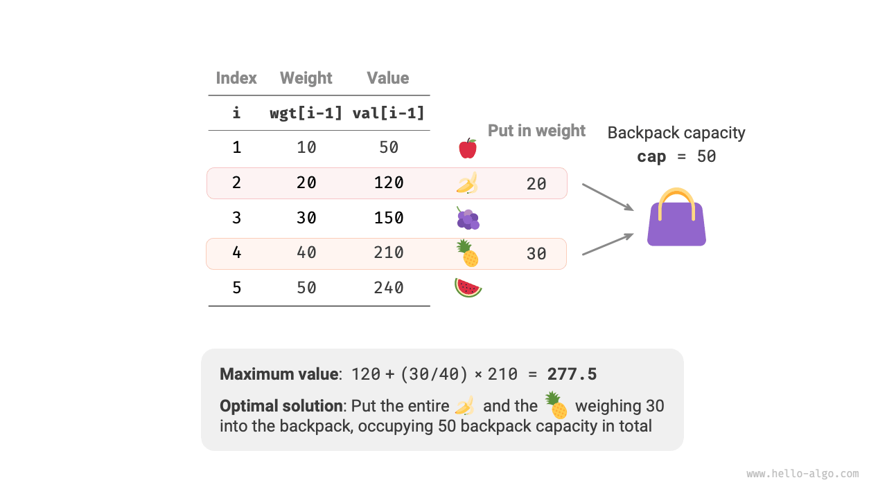
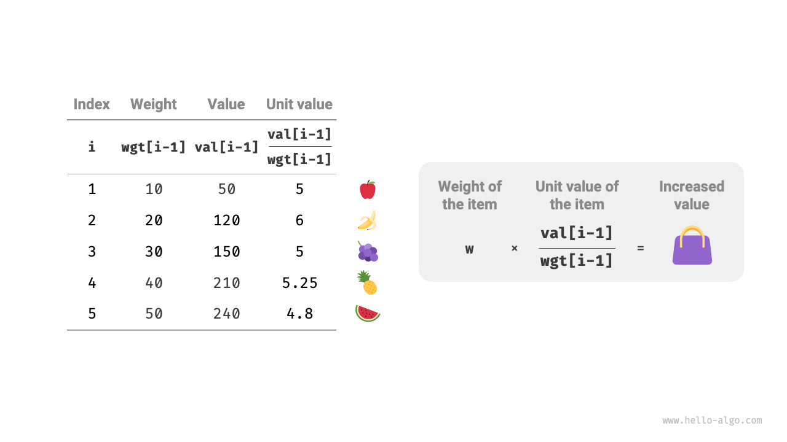

# Fractional knapsack problem

!!! question

    Given $n$ items, the weight of the $i$-th item is $wgt[i-1]$ and its value is $val[i-1]$, and a knapsack with a capacity of $cap$. Each item can be chosen only once, **but a part of the item can be selected, with its value calculated based on the proportion of the weight chosen**, what is the maximum value of the items in the knapsack under the limited capacity? An example is shown below.



The fractional knapsack problem is very similar overall to the 0-1 knapsack problem, involving the current item $i$ and capacity $c$, aiming to maximize the value within the limited capacity of the knapsack.

The difference is that, in this problem, only a part of an item can be chosen. As shown in the figure below, **we can arbitrarily split the items and calculate the corresponding value based on the weight proportion**.

1. For item $i$, its value per unit weight is $val[i-1] / wgt[i-1]$, referred to as the unit value.
2. Suppose we put a part of item $i$ with weight $w$ into the knapsack, then the value added to the knapsack is $w \times val[i-1] / wgt[i-1]$.



### Greedy strategy determination

Maximizing the total value of the items in the knapsack essentially means maximizing the value per unit weight. From this, the greedy strategy shown below can be deduced.

1. Sort the items by their unit value from high to low.
2. Iterate over all items, **greedily choosing the item with the highest unit value in each round**.
3. If the remaining capacity of the knapsack is insufficient, use part of the current item to fill the knapsack.


### Code implementation

We have created an `Item` class in order to sort the items by their unit value. We loop and make greedy choices until the knapsack is full, then exit and return the solution:

```src
[file]{fractional_knapsack}-[class]{}-[func]{fractional_knapsack}
```

Apart from sorting, in the worst case, the entire list of items needs to be traversed, **hence the time complexity is $O(n)$**, where $n$ is the number of items.

Since an `Item` object list is initialized, **the space complexity is $O(n)$**.

### Correctness proof

Using proof by contradiction. Suppose item $x$ has the highest unit value, and some algorithm yields a maximum value `res`, but the solution does not include item $x$.

Now remove a unit weight of any item from the knapsack and replace it with a unit weight of item $x$. Since the unit value of item $x$ is the highest, the total value after replacement will definitely be greater than `res`. **This contradicts the assumption that `res` is the optimal solution, proving that the optimal solution must include item $x$**.

For other items in this solution, we can also construct the above contradiction. Overall, **items with greater unit value are always better choices**, proving that the greedy strategy is effective.

As shown in the figure below, if the item weight and unit value are viewed as the horizontal and vertical axes of a two-dimensional chart respectively, the fractional knapsack problem can be transformed into "seeking the largest area enclosed within a limited horizontal axis range". This analogy can help us understand the effectiveness of the greedy strategy from a geometric perspective.


