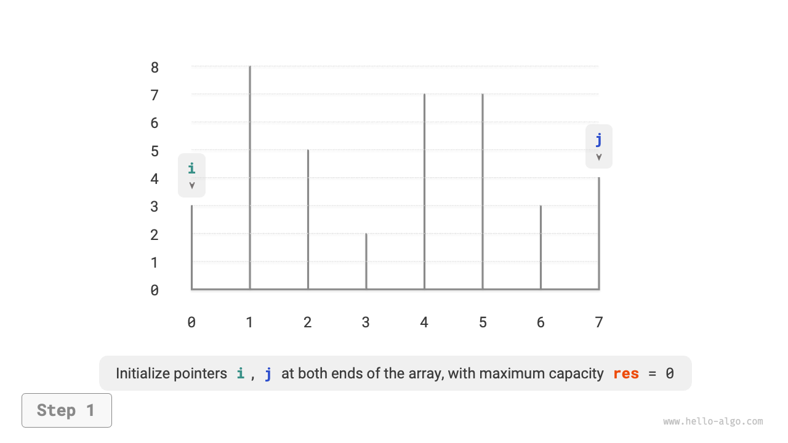
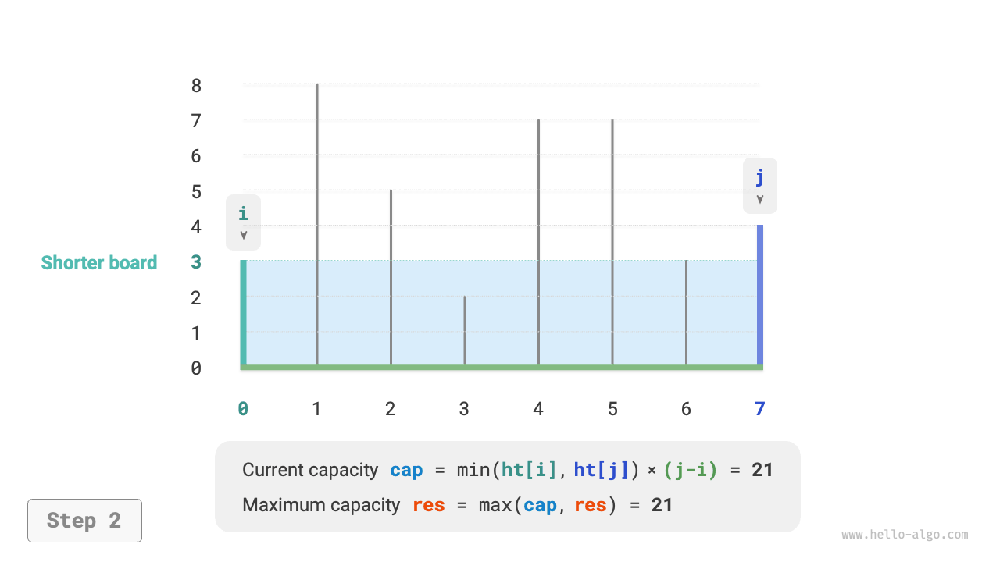
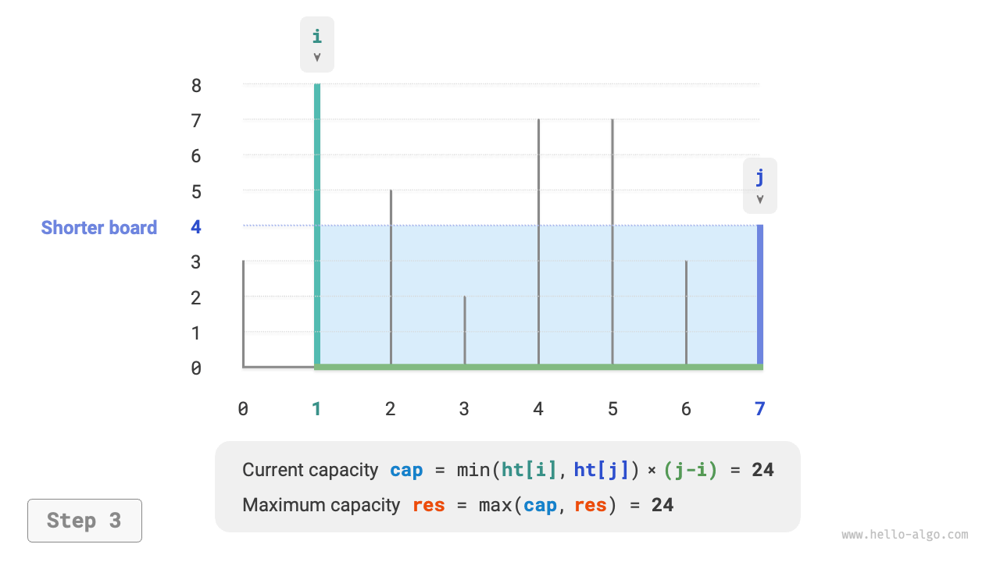

# Maximum capacity problem

!!! question

    Input an array $ht$, where each element represents the height of a vertical partition. Any two partitions in the array, along with the space between them, can form a container.
    
    The capacity of the container is the product of the height and the width (area), where the height is determined by the shorter partition, and the width is the difference in array indices between the two partitions.
    
    Please select two partitions in the array that maximize the container's capacity and return this maximum capacity. An example is shown in the following figure.


The container is formed by any two partitions, **therefore the state of this problem is represented by the indices of the two partitions, denoted as $[i, j]$**.

According to the problem statement, the capacity equals the product of height and width, where the height is determined by the shorter partition, and the width is the difference in array indices between the two partitions. The formula for capacity $cap[i, j]$ is:

$$
cap[i, j] = \min(ht[i], ht[j]) \times (j - i)
$$

Assuming the length of the array is $n$, the number of combinations of two partitions (total number of states) is $C_n^2 = \frac{n(n - 1)}{2}$. The most straightforward approach is to **enumerate all possible states**, resulting in a time complexity of $O(n^2)$.

### Determination of a greedy strategy

There is a more efficient solution to this problem. As shown in the following figure, we select a state $[i, j]$ where the indices $i < j$ and the height $ht[i] < ht[j]$, meaning $i$ is the shorter partition, and $j$ is the taller one.


As shown in the following figure, **if we move the taller partition $j$ closer to the shorter partition $i$, the capacity will definitely decrease**.

This is because when moving the taller partition $j$, the width $j-i$ definitely decreases; and since the height is determined by the shorter partition, the height can only remain the same (if $i$ remains the shorter partition) or decrease (if the moved $j$ becomes the shorter partition).


Conversely, **we can only possibly increase the capacity by moving the shorter partition $i$ inward**. Although the width will definitely decrease, **the height may increase** (if the moved shorter partition $i$ becomes taller). For example, in the figure below, the area increases after moving the shorter partition.


This leads us to the greedy strategy for this problem: initialize two pointers at the ends of the container, and in each round, move the pointer corresponding to the shorter partition inward until the two pointers meet.

The following figures illustrate the execution of the greedy strategy.

1. Initially, the pointers $i$ and $j$ are positioned at the ends of the array.
2. Calculate the current state's capacity $cap[i, j]$ and update the maximum capacity.
3. Compare the heights of partitions $i$ and $j$, and move the shorter partition inward by one step.
4. Repeat steps `2.` and `3.` until $i$ and $j$ meet.

=== "<1>"
    

=== "<2>"
    

=== "<3>"
    

=== "<4>"
    

=== "<5>"
    

=== "<6>"
    

=== "<7>"
    

=== "<8>"
    

=== "<9>"
    

### Implementation

The code loops at most $n$ times, **thus the time complexity is $O(n)$**.

The variables $i$, $j$, and $res$ use a constant amount of extra space, **thus the space complexity is $O(1)$**.

```src
[file]{max_capacity}-[class]{}-[func]{max_capacity}
```

### Proof of correctness

The reason why the greedy method is faster than enumeration is that each round of greedy selection "skips" some states.

For example, under the state $cap[i, j]$ where $i$ is the shorter partition and $j$ is the taller partition, greedily moving the shorter partition $i$ inward by one step leads to the "skipped" states shown below. **This means that these states' capacities cannot be verified later**.

$$
cap[i, i+1], cap[i, i+2], \dots, cap[i, j-2], cap[i, j-1]
$$


It is observed that **these skipped states are actually all states where the taller partition $j$ is moved inward**. We have already proven that moving the taller partition inward will definitely decrease the capacity. Therefore, the skipped states cannot possibly be the optimal solution, **and skipping them does not lead to missing the optimal solution**.

The analysis shows that the operation of moving the shorter partition is "safe", and the greedy strategy is effective.
